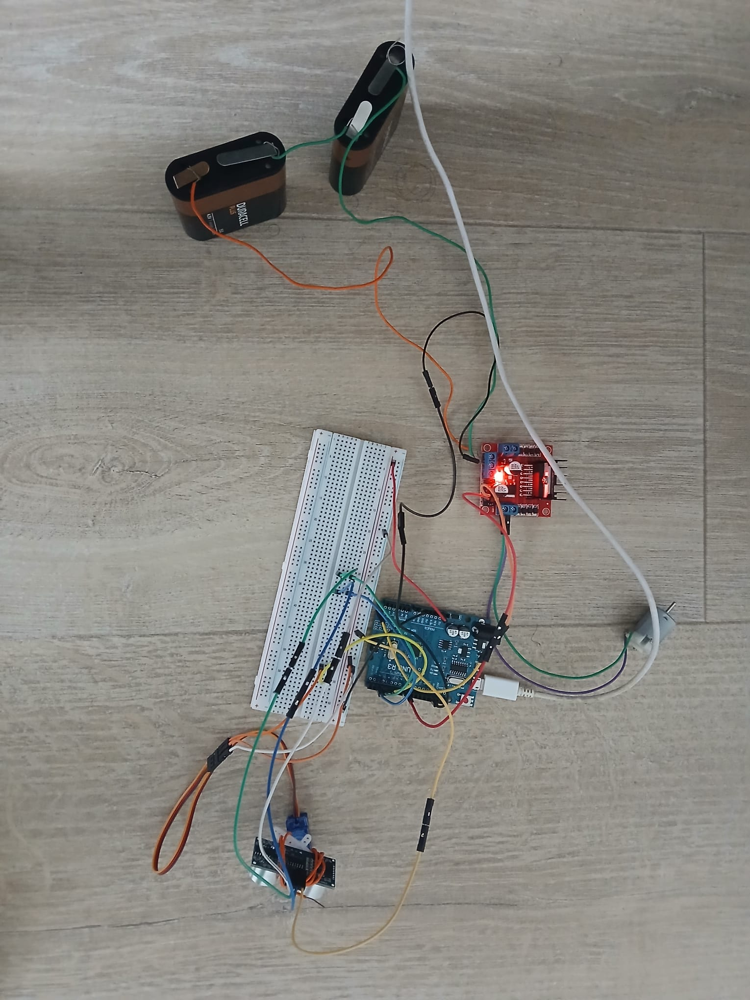

# Ultrasonic-Defense-System
An autonomous Arduino-based sentry turret that scans the environment using an ultrasonic sensor and activates a suppression motor upon detecting targets within close range.
# 🛡️ Autonomous Sentry Turret v1.0

*Prototype of the autonomous defense system.*

## 📋 Overview
This project consists of an **autonomous sentry turret** designed to patrol a specific area and react to intruders. Using an **Arduino Uno** as the central controller, the system performs a continuous 180° sweep with an ultrasonic sensor.

When an object is detected within the security perimeter (defined as **15 cm**), the system halts the scan and engages the "suppression system" (a DC motor simulating a weapon or alarm) for a calibrated duration before resuming the patrol.

## ⚙️ Features
* **Radar Sweep:** Continuous 0° to 180° surveillance using a Servo motor.
* **Real-time Detection:** Calculates distance using the HC-SR04 Ultrasonic Sensor.
* **Autonomous Reaction:** Automatically triggers the DC motor driver (L298N) upon threat detection.
* **Sequential Logic:** "Stop-Fire-Resume" behavior algorithm.

## 🛠️ Hardware Components
* **Microcontroller:** Arduino Uno R3
* **Sensors:** HC-SR04 Ultrasonic Module
* **Actuators:**
    * SG90 Micro Servo (for radar movement)
    * DC Motor (simulating the turret cannon)
* **Drivers:** L298N Dual H-Bridge Motor Driver
* **Power:** External Battery Pack (9V/Series configuration) for the motors

## 🔌 Pinout Configuration
| Component | Arduino Pin |
|-----------|-------------|
| **Ultrasonic Trig** | D2 |
| **Ultrasonic Echo** | D3 |
| **Servo Signal** | D5 |
| **Motor Driver IN3** | D8 |
| **Motor Driver IN4** | D9 |

## 🚀 How it Works
1.  **Scanning:** The servo sweeps the ultrasonic sensor back and forth.
2.  **Sensing:** The sensor emits ultrasonic pulses to measure the distance to the nearest object.
3.  **Decision Making:**
    * IF distance > 15cm: Continue scanning.
    * IF distance <= 15cm: **Target Acquired.**
4.  **Action:**
    * Stop servo movement.
    * Activate DC Motor (Fire) for 1000ms.
    * Deactivate Motor.
    * Resume scanning pattern.

## 🔮 Future Improvements
* Integration of **MPU6050 Gyroscope** for motion stabilization.
* **Bluetooth (HC-06)** module for remote telemetry and manual override.
* **Processing IDE** integration for a real-time visual radar interface on PC.

---
*Created by [Your Name/Username]*
